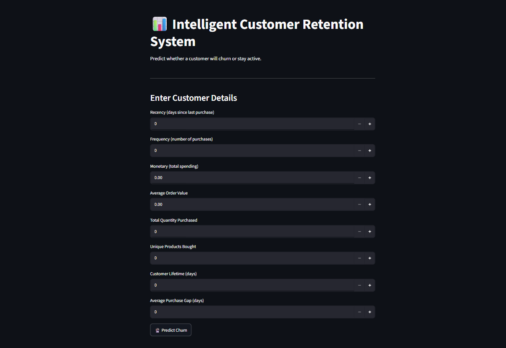
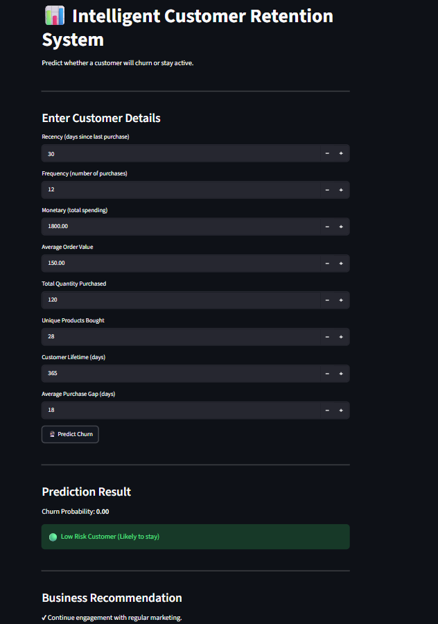

# 📊 Customer Retention & Churn Prediction System

An end-to-end Machine Learning project that predicts customer churn using historical e-commerce transaction data from the **Online Retail II** dataset.

The project includes data preprocessing, feature engineering, machine learning model development, model evaluation, and deployment using **Streamlit**.

---

## 🚀 Project Overview

Customer retention is one of the most important challenges in e-commerce. Losing customers directly impacts revenue and business growth.

This project predicts whether a customer is likely to churn based on their purchasing behavior, enabling businesses to take proactive retention measures.

---

## 🎯 Objectives

- Analyze customer purchasing behavior
- Build customer-level features
- Predict customer churn using machine learning
- Provide real-time predictions through a Streamlit application
- Generate business recommendations based on churn risk

---

## 📂 Dataset

**Dataset:** Online Retail II

The dataset contains real-world online retail transactions, including:

- Invoice Number
- Product Code
- Product Description
- Quantity
- Invoice Date
- Unit Price
- Customer ID
- Country

---

## 🛠 Technologies Used

- Python
- Pandas
- NumPy
- Scikit-learn
- XGBoost
- Matplotlib
- Streamlit
- Joblib

---

## 📁 Project Structure

```text
customer-retention-system/
│
├── app/
│   ├── __init__.py
│   ├── main.py
│   └── prediction.py
│
├── data/
│   ├── raw/
│   └── processed/
│
├── models/
│   ├── churn_model.pkl
│   ├── scaler.pkl
│   └── feature_columns.pkl
│
├── notebooks/
│   ├── 01_data_understanding.ipynb
│   ├── 02_data_cleaning.ipynb
│   ├── 03_eda.ipynb
│   ├── 04_feature_engineering.ipynb
│   ├── 05_model_training.ipynb
│   ├── 06_model_evaluation.ipynb
│   └── 07_prediction_test.ipynb
│
├── reports/
│
├── screenshots/
│   ├── home.png
│   └── prediction.png
│
├── src/
│   ├── __init__.py
│   ├── feature_engineering.py
│   └── train_model.py
│
├── README.md
├── requirements.txt
└── .gitignore
```

---

## 🔄 Project Workflow

1. Data Collection
2. Data Cleaning
3. Exploratory Data Analysis (EDA)
4. Feature Engineering
5. Customer Churn Label Creation
6. Model Training
7. Model Evaluation
8. Model Selection
9. Model Deployment using Streamlit

---

## 📊 Features Used

The model uses customer purchasing behavior such as:

- Recency
- Frequency
- Monetary Value
- Average Order Value
- Total Quantity Purchased
- Number of Unique Products
- Customer Lifetime
- Average Purchase Gap

---

## 🤖 Machine Learning Models

The following models were trained and compared:

- Logistic Regression
- Decision Tree
- Random Forest
- XGBoost

The best-performing model was selected for deployment.

---

## 📈 Model Evaluation

The model was evaluated using:

- Accuracy
- Precision
- Recall
- F1 Score
- ROC-AUC Score
- Confusion Matrix

---

## 💻 Streamlit Application

The application allows users to:

- Enter customer details
- Predict churn probability
- Identify customer risk level
- View business recommendations

---

## 📸 Screenshots

### Home Page



---

### Prediction Result



---

## ▶️ Installation

Clone the repository:

```bash
git clone https://github.com/YOUR_USERNAME/customer-retention-system.git
```

Move into the project directory:

```bash
cd customer-retention-system
```

Install dependencies:

```bash
pip install -r requirements.txt
```

Run the Streamlit application:

```bash
streamlit run app/main.py
```

---

## 🔮 Future Improvements

- Customer Lifetime Value (CLV) Prediction
- Customer Segmentation Dashboard
- Interactive Business Analytics Dashboard
- Cloud Deployment
- Explainable AI (SHAP)

---

## 👨‍💻 Author

**Shantharaj K**

Aspiring Data Scientist | Machine Learning | Data Analytics

---